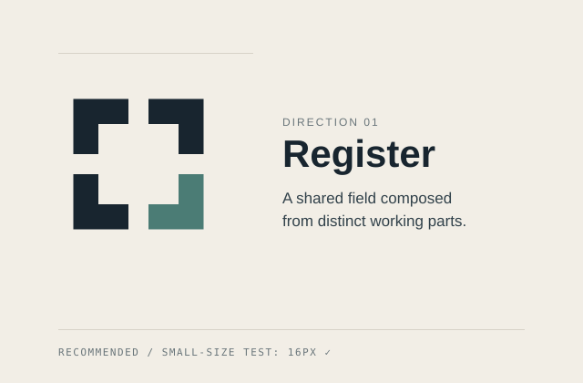
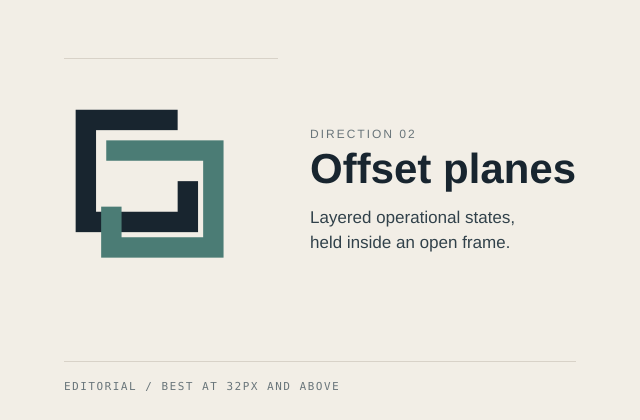
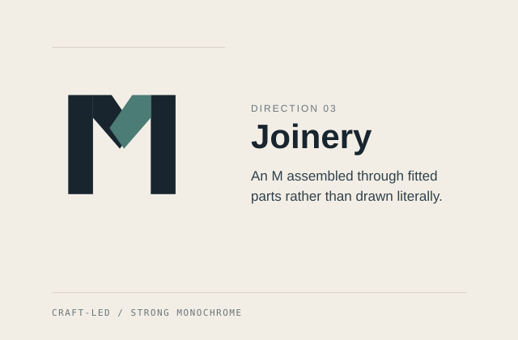
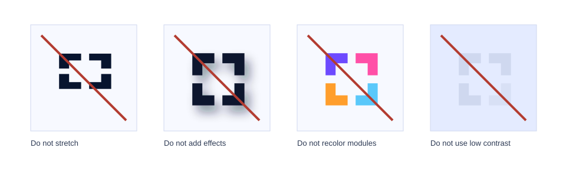

# MerchantCanvas identity system

MerchantCanvas is the endorsement brand for a portfolio of focused Shopify
apps. The identity is intentionally product-neutral: it expresses a structured
working surface, not discounts, quoting, ecommerce, or any single app feature.

## Explored directions

### 01 — Register (recommended)

Four inward-facing modules compose a square around a precise central workspace.
The construction feels like registration marks, layout structure, and a system
of distinct products sharing one standard; its compact silhouette also remains
clear at favicon size. This direction works best as an endorsement mark, app
family signature, website identity, and quiet document stamp.

### 02 — Offset planes

Two open, offset frames suggest a layered working surface and the movement from
one operational state to another. It has an elegant editorial quality and works
best at medium and large sizes, but its overlapping detail is less decisive than
Register below 24px.

### 03 — Joinery

A set of fitted rails creates an abstract structural M through construction
rather than a conventional letter outline. The idea communicates practical
craft and is strong in monochrome, but reads more like a single-company
lettermark than a flexible portfolio framework.

## Recommendation

**Register** is the production direction. It is the most product-neutral and
the strongest at the 16–48px sizes required for favicons, social avatars, and
app-family endorsements. The four modules naturally represent a growing set of
products, while the central opening preserves the “canvas” idea as a considered
space where work is arranged.

The lower-right module is the only accent in the color mark. It acts as a quiet
point of human judgement inside an otherwise systematic construction; it is not
tied to a particular product, status, or Shopify convention.

## Production assets

| Asset | Intended use |
| --- | --- |
| `merchantcanvas-lockup-light.svg` | Primary ink + cobalt lockup on light backgrounds |
| `merchantcanvas-lockup-dark.svg` | Ice + coral lockup on dark backgrounds |
| `merchantcanvas-lockup-color.svg` | Compatibility alias for the light lockup |
| `merchantcanvas-lockup-reverse.svg` | Compatibility alias for the dark lockup |
| `merchantcanvas-lockup-ink.svg` | One-color midnight-ink lockup |
| `merchantcanvas-lockup-white.svg` | Strict one-color white lockup |
| `merchantcanvas-symbol-light.svg` | Compact ink + cobalt symbol |
| `merchantcanvas-symbol-dark.svg` | Compact ice + coral symbol |
| `merchantcanvas-symbol-color.svg` | Compatibility alias for the light symbol |
| `merchantcanvas-symbol-ink.svg` | One-color compact symbol |
| `merchantcanvas-symbol-white.svg` | White compact symbol |
| `merchantcanvas-app-icon-light.svg` | Cobalt + sun app-family icon |
| `merchantcanvas-app-icon-dark.svg` | Deep-sea + coral app-family icon |
| `merchantcanvas-app-icon.svg` | Default app-family/social icon |
| `merchantcanvas-app-icon-512.png` | Default 512px raster export |
| `merchantcanvas-symbol-16/24/32/48.png` | Light small-size QA and raster placements |
| `merchantcanvas-symbol-dark-16/24/32/48.png` | Dark small-size QA and raster placements |
| `favicon.svg` | OS-theme-aware browser icon |
| `favicon-light.svg`, `favicon-dark.svg` | Explicit site-theme browser icons |
| `favicon-32.png` | Light-theme PNG fallback |
| `apple-touch-icon.png` | 180px touch icon |
| `og.png` | 1200×630 social preview |
| `production-proof.svg`, `production-proof.png` | Light, dark, and 16–48px visual proof sheet |

SVG artwork uses outlined wordmark paths, so it does not depend on a font being
installed at the point of use.

## Color tokens

| Token | Hex | Use |
| --- | --- | --- |
| Midnight Ink | `#07142E` | Light-theme wordmark and core symbol modules |
| Cloud Canvas | `#F7F9FF` | Primary light background |
| White Paper | `#FFFFFF` | Light contained surfaces and monochrome reverse use |
| Signal Cobalt | `#164BFF` | Light-theme register and app-icon field |
| Daylight Sun | `#FFD51E` | Light app-icon register |
| Deep-Sea Canvas | `#06131F` | Primary dark background and dark icon field |
| Ice Ink | `#F5FBFF` | Dark-theme wordmark and core symbol modules |
| Night Azure | `#3E9BFF` | Dark-theme primary UI signal |
| Signal Coral | `#FF725B` | Dark-theme register |

The identity follows the site's two-sky rule: light mode uses ink + cobalt,
while dark mode uses ice + coral. The app icon adds sun in light mode. Keep one
register accent per mark, never substitute Shopify green, and do not use
gradients.

## Typography

The wordmark is a custom outlined setting derived from **Manrope 720**, with
logo-specific tracking and optical alignment. The artwork is converted to
paths; do not reset it as live text.

Use **Manrope** across the site, product pages, documents, and presentations:
400–500 for body copy, 700 for actions, and 760–780 for compact headlines. Use
the available sans-serif fallbacks only when Manrope cannot be embedded.

## Clear space

Define `x` as the thickness of one symbol module (10/64 of the symbol width).
Keep at least `1x` clear on every side of the compact symbol and `1.5x` around
the horizontal lockup. No type, rules, edges, or partner marks should enter
this area.

In a “by MerchantCanvas” endorsement, keep a gap of at least `0.75x` between
“by” and the lockup. The product name remains visually primary; the
MerchantCanvas lockup should be approximately 55–70% of the product name’s
cap height.

## Minimum sizes

- Compact symbol: 16px digital or 5mm print.
- Horizontal lockup: 120px digital or 32mm print.
- App-family icon: 24px digital; use the simplified `favicon.svg` at 16px.
- Below the horizontal lockup minimum, use the compact symbol and accessible
  text rather than shrinking the wordmark further.

## Background use

Use `merchantcanvas-lockup-light.svg` on Cloud Canvas, White Paper, and other
very light backgrounds. Use `merchantcanvas-lockup-dark.svg` on Deep-Sea
Canvas, dark panels, or photography with a quiet, consistently dark area. If
background contrast is uncertain, place the mark on one of those solid fields.

The all-white and all-Ink versions remain intentional monochrome variants. The
mark must remain understandable with the register accent removed.

## Incorrect use

Do not:

- stretch, condense, rotate, skew, or rearrange the modules;
- recolor individual modules or introduce a second accent;
- add gradients, glows, shadows, outlines, or three-dimensional effects;
- place the color mark on a low-contrast or visually busy background;
- set the wordmark in a substitute font or change the `MerchantCanvas`
  capitalization;
- put the symbol inside a Shopify bag, use Shopify green, or imply affiliation;
- combine the endorsement mark with an app-specific symbol into one permanent
  logo.

## Pre-launch legal check

The owner must perform a professional trademark/conflict check before final
commercial use. This original design process is not a legal clearance and does
not establish registrability in any jurisdiction.
